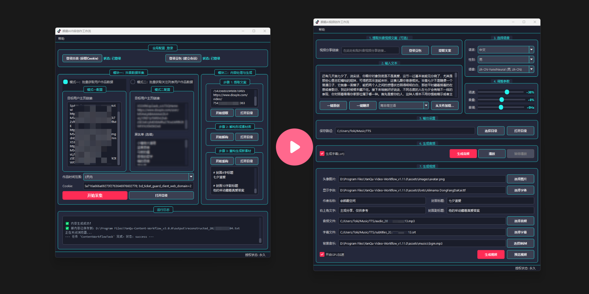

# AI-TTV-Workflow: AI驱动的文本转视频创作工作流

[简体中文](./README.md) | [English](./README_en.md)

[](https://github.com/toki-plus/ai-ttv-workflow/stargazers)
[](https://github.com/toki-plus/ai-ttv-workflow/network/members)
[](https://choosealicense.com/licenses/mit/)
[](https://github.com/toki-plus/ai-ttv-workflow/pulls)

**AI-TTV-Workflow 是一款免费、开源的桌面应用程序，旨在全自动地将文本内容转化为引人入胜的短视频。**

本项目专为内容创作者、新媒体运营及开发者设计，致力于简化视频制作流程。无论是文章、脚本，甚至是已有的视频文案，都能被快速转换成可直接发布的短视频，适用于抖音、B站、YouTube Shorts、小红书等平台。

<p align="center">
  <a href="https://www.bilibili.com/video/BV1mzhXzsEJ1" target="_blank">
    
  </a>
  <br>
  <em>(点击封面图跳转到 B 站观看高清演示视频)</em>
</p>

---

## ✨ 核心功能

这不仅仅是一个视频剪辑工具，而是一个完整的智能化工作流：

-   **🤖 AI驱动的内容引擎**:
    -   **一键提取文案**: 只需粘贴抖音视频分享链接，即可自动提取完整的视频文案。
    -   **AI一键二创**: 对现有文案进行深度去重和二次创作，一键生成原创内容。
    -   **AI一键翻译**: 将文案翻译成数十种语言，轻松实现内容的全球化分发。
    -   **智能生成标题**: 根据文案内容，自动为视频封面生成吸引人的主标题和副标题。

-   **🎙️ 先进的文本转语音 (TTS)**:
    -   **高品质人声**: 集成微软Edge TTS (`edge-tts`) 引擎，提供覆盖多语言、多性别的自然流畅人声。
    -   **参数精细调校**: 支持对语速、音调、音量进行微调，以匹配视频的情感基调。
    -   **自动生成字幕**: 在生成音频的同时，完美同步生成 `.srt` 格式的字幕文件。

-   **🎬 视频与封面自动化生成**:
    -   **FFmpeg强力驱动**: 基于强大的 FFmpeg 进行视频处理，稳定高效。
    -   **动态字幕嵌入**: 将字幕文件自动嵌入视频，并支持自定义字体。
    -   **个性化品牌设置**: 轻松添加自定义的圆形头像、作者名称和背景音乐 (BGM)。
    -   **专业级封面图**: 自动生成适用于短视频平台的竖屏封面图 (9:16)。
    -   **🚀 GPU加速支持**: 支持NVIDIA显卡 (NVENC) 加速，大幅缩短视频渲染时间。

-   **GUI与用户体验**:
    -   **跨平台图形界面**: 基于 PyQt5 构建，在 Windows、macOS 和 Linux 上均提供简洁直观的操作体验。
    -   **驱动自动管理**: 首次使用AI功能时，程序会自动下载匹配当前Chrome版本的驱动程序，免去繁琐配置。

## 📸 软件截图

<p align="center">
  
  <br>
  <em>软件主界面，所有工作流步骤一目了然。</em>
</p>

<p align="center">
  
  <br>
  <em>自动生成的视频封面图示例。</em>
</p>

## 🚀 快速开始

### 系统要求

1.  **Python**: 3.8 或更高版本。
2.  **FFmpeg**: **必须**安装 FFmpeg 并将其添加到系统环境变量中。
    -   请访问 [FFmpeg 官网](https://ffmpeg.org/download.html) 查看安装教程。
    -   检查是否安装成功：打开终端或命令提示符，输入 `ffmpeg -version`，如果能看到版本信息则表示安装成功。
3.  **Google Chrome 浏览器**: 使用AI功能需要。

### 安装与启动

1.  **克隆本仓库：**
    ```bash
    git clone https://github.com/toki-plus/ai-ttv-workflow.git
    cd ai-ttv-workflow
    ```

2.  **创建并激活虚拟环境 (推荐)：**
    ```bash
    python -m venv venv
    # Windows 系统
    venv\Scripts\activate
    # macOS/Linux 系统
    source venv/bin/activate
    ```

3.  **安装依赖库：**
    ```bash
    pip install -r requirements.txt
    ```

4.  **运行程序：**
    ```bash
    python main.py
    ```
    当你首次使用AI相关功能时，程序会自动为你下载匹配的 `chromedriver`。

## 📖 使用指南

软件界面从上到下的布局即是推荐的工作流程。

1.  **第一步：获取文案 (可选)**
    -   首次使用AI功能时，请先点击 **“登录豆包”**。在弹出的浏览器中完成登录（如扫码），然后 **手动关闭该浏览器窗口**。登录状态会被保存，后续无需重复操作。
    -   在输入框中粘贴抖音视频链接，点击 **“提取文案”**，软件将自动填充文案和推荐的封面标题。
    -   你也可以直接在文本框中手动输入或粘贴你的文案。

2.  **第二步：编辑和润色文案**
    -   手动修改文本内容。
    -   使用 **“一键原创”** 或 **“一键翻译”** 功能，让AI对你的文案进行再加工。

3.  **第三、四步：选择声音并调整参数**
    -   根据需求选择语言、性别和具体的发音人。
    -   通过拖动滑块来调整语速、音量和音调。

4.  **第五步：生成音频和字幕**
    -   选择一个用于保存文件的输出目录。
    -   勾选“生成字幕”（强烈推荐）。
    -   点击 **“生成音频”**。一个 `.mp3` 音频文件和一个 `.srt` 字幕文件将被创建。

5.  **第六步：配置并生成视频**
    -   音频和字幕文件的路径会被自动填充。
    -   配置视频的各项参数：选择你的头像图片、字体文件、设置作者名称等。
    -   （可选）添加背景音乐 (BGM)。
    -   如果你的电脑有NVIDIA显卡，可以勾选“开启GPU加速”。
    -   点击 **“生成视频”**！稍等片刻，最终的 `.mp4` 视频和封面图就会出现在你的输出目录中。

## 💼 寻求自动化工具定制开发？

这个开源项目是我在桌面自动化和内容创作工具领域技术能力的展示。如果你觉得这个项目对你有帮助，并希望获得更符合你业务需求的定制化解决方案，我非常乐意提供付费的定制开发服务。

服务范围包括但不限于：
-   **对接不同平台**：如YouTube、B站、小红书、Twitter等平台的自动化操作。
-   **功能扩展**：为现有工作流增加更多高级功能。
-   **全新工具开发**：根据你的需求，从零开始打造专属的自动化工具。
-   **云端部署与API开发**：将工作流部署在服务器上，实现7x24小时无人值守运行。

**欢迎与我联系，让我们一起打造能为你创造价值的工具！**

<p align="center">
  <strong>业务定制与技术交流，请添加：</strong>
</p>
<table align="center">
  <tr>
    <td align="center">
      
      <br />
      <sub><b>个人微信</b></sub>
      <br />
      <sub>微信号: toki-plus (请备注“GitHub工具定制”)</sub>
    </td>
    <td align="center">
      
      <br />
      <sub><b>公众号</b></sub>
      <br />
      <sub>获取最新技术分享与项目更新</sub>
    </td>
  </tr>
</table>

## 📂 我的其他开源项目

-   **[Video Mover](https://github.com/toki-plus/video-mover)**: 一个强大的、全自动化的内容创作流水线工具。它可以自动监听、下载指定的博主发布的视频，进行深度、多维度的视频去重处理，并利用AI大模型生成爆款标题，最终自动发布到不同平台。
-   **[AB 视频去重工具](https://github.com/toki-plus/AB-Video-Deduplicator)**: 通过创新的“高帧率抽帧混合”技术，从根本上重构视频数据指纹，以规避主流短视频平台的原创度检测和查重机制。

## 🤝 参与贡献

欢迎任何形式的贡献！如果你有新的功能点子、发现了Bug，或者有任何改进建议，请：
-   提交一个 [Issue](https://github.com/toki-plus/ai-ttv-workflow/issues) 进行讨论。
-   Fork 本仓库并提交 [Pull Request](https://github.com/toki-plus/ai-ttv-workflow/pulls)。

如果这个项目对你有帮助，请不吝点亮一颗 ⭐！

## 📜 开源协议


本项目基于 MIT 协议开源。详情请见 [LICENSE](LICENSE) 文件。


