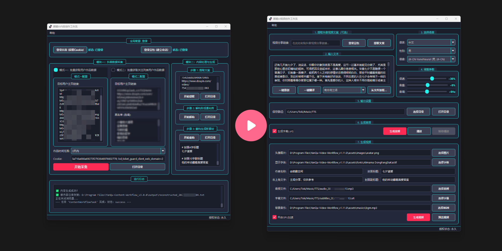
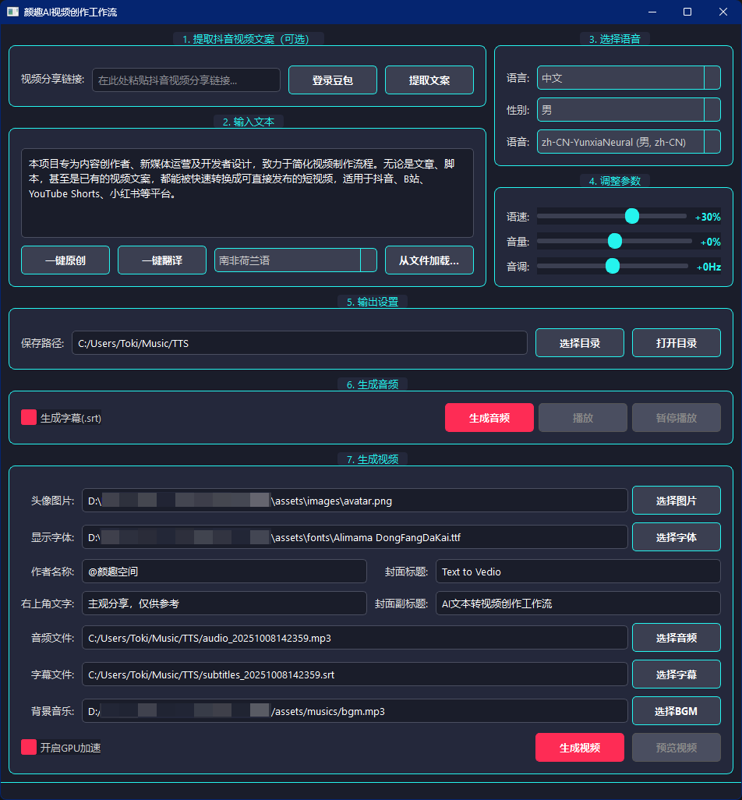

# AI-TTV-Workflow: An AI-Powered Text-to-Video Creation Workflow

[简体中文](./README.md) | [English](./README_en.md)

[](https://github.com/toki-plus/ai-ttv-workflow/stargazers)
[](https://github.com/toki-plus/ai-ttv-workflow/network/members)
[](https://choosealicense.com/licenses/mit/)
[](https://github.com/toki-plus/ai-ttv-workflow/pulls)

**AI-TTV-Workflow is a free, open-source desktop application designed to automatically transform text content into engaging short videos.**

This project is built for content creators, social media managers, and developers looking to streamline their video production pipeline. Turn articles, scripts, or even existing video transcripts into ready-to-publish short videos for platforms like TikTok, YouTube Shorts, Instagram Reels, and more.

<p align="center">
  <a href="https://www.bilibili.com/video/BV1mzhXzsEJ1" target="_blank">
    
  </a>
  <br>
  <em>(Click the cover to watch the HD demo video on Bilibili)</em>
</p>

---

## ✨ Core Features

This is more than just a video editor; it's a complete, intelligent workflow:

-   **🤖 AI-Powered Content Engine**:
    -   **One-Click Script Extraction**: Simply paste a Douyin (China's TikTok) share link to automatically extract the full video script.
    -   **AI-Powered Rewrite**: Perform deep paraphrasing and rewriting on existing text to generate unique, original content with a single click.
    -   **AI-Powered Translation**: Translate scripts into dozens of languages to effortlessly globalize your content.
    -   **Intelligent Title Generation**: Automatically creates catchy main titles and subtitles for your video cover based on the script's content.

-   **🎙️ Advanced Text-to-Speech (TTS)**:
    -   **High-Quality Voices**: Integrates with the Microsoft Edge TTS (`edge-tts`) engine, offering natural and fluent voices across multiple languages and genders.
    -   **Fine-Tuned Control**: Allows for precise adjustments of speech rate, pitch, and volume to match the emotional tone of your video.
    -   **Automatic Subtitle Generation**: Perfectly synchronized `.srt` subtitle files are generated alongside the audio.

-   **🎬 Automated Video & Cover Synthesis**:
    -   **Powered by FFmpeg**: Utilizes the robust and efficient FFmpeg library for all video processing tasks.
    -   **Dynamic Subtitle Embedding**: Automatically burns subtitles into the video with support for custom fonts.
    -   **Personalized Branding**: Easily add a custom circular avatar, author name, and background music (BGM).
    -   **Professional Cover Art**: Automatically generates a 9:16 vertical cover image suitable for short-form video platforms.
    -   **🚀 GPU Acceleration**: Supports NVIDIA (NVENC) hardware acceleration to dramatically reduce video rendering times.

-   **GUI & User Experience**:
    -   **Cross-Platform Interface**: Built with PyQt5, offering a clean and intuitive user experience on Windows, macOS, and Linux.
    -   **Automatic Driver Management**: On the first use of AI features, the application automatically downloads the correct `chromedriver` to match your version of Chrome, eliminating manual setup.

## 📸 Screenshots

<p align="center">
  
  <br>
  <em>The main interface, where every step of the workflow is clearly laid out.</em>
</p>

<p align="center">
  
  <br>
  <em>An example of an automatically generated video cover.</em>
</p>

## 🚀 Quick Start

### System Requirements

1.  **Python**: Version 3.8 or newer.
2.  **FFmpeg**: You **must** have FFmpeg installed and added to your system's PATH.
    -   Visit the [FFmpeg official website](https://ffmpeg.org/download.html) for installation instructions.
    -   To check if it's installed correctly, open a terminal or command prompt and run `ffmpeg -version`. You should see version information printed.
3.  **Google Chrome**: Required for the AI-powered features.

### Installation & Launch

1.  **Clone the repository:**
    ```bash
    git clone https://github.com/toki-plus/ai-ttv-workflow.git
    cd ai-ttv-workflow
    ```

2.  **Create and activate a virtual environment (recommended):**
    ```bash
    python -m venv venv
    # On Windows
    venv\Scripts\activate
    # On macOS/Linux
    source venv/bin/activate
    ```

3.  **Install dependencies:**
    ```bash
    pip install -r requirements.txt
    ```

4.  **Run the application:**
    ```bash
    python main.py
    ```
    The first time you use an AI-related feature, the application will automatically download the matching `chromedriver` for you.

## 📖 Usage Guide

The application's top-to-bottom layout represents the recommended workflow.

1.  **Step 1: Get Your Script (Optional)**
    -   Before using AI features for the first time, click **"登录豆包" (Login Doubao)**. Log in within the browser window that appears (e.g., by scanning the QR code), and then **manually close the browser window**. Your session will be saved for future use.
    -   Paste a Douyin video link and click **"提取文案" (Extract Script)**. The script and recommended cover titles will be auto-filled.
    -   Alternatively, you can type or paste your own script directly into the text box.

2.  **Step 2: Edit and Refine Your Script**
    -   Manually edit the text as needed.
    -   Use the **"一键原创" (Rewrite)** or **"一键翻译" (Translate)** buttons to have the AI process your script further.

3.  **Steps 3 & 4: Select a Voice and Adjust Parameters**
    -   Choose a language, gender, and specific voice from the dropdown menus.
    -   Use the sliders to fine-tune the speech rate, volume, and pitch.

4.  **Step 5: Generate Audio and Subtitles**
    -   Select an output directory for your files.
    -   Check the "Generate Subtitles" box (highly recommended).
    -   Click **"生成音频" (Generate Audio)**. An `.mp3` audio file and an `.srt` subtitle file will be created.

5.  **Step 6: Configure and Generate the Video**
    -   The paths for the audio and subtitle files will be filled automatically.
    -   Configure your video's parameters: select an avatar image, a font file, set the author name, etc.
    -   (Optional) Add background music (BGM).
    -   If you have a supported NVIDIA GPU, check "Enable GPU Acceleration".
    -   Click **"生成视频" (Generate Video)**! After a short wait, your final `.mp4` video and cover image will be ready in your output directory.

## 👨‍💻 About the Author

Hi, I'm Toki, the author of this project.

> **Ex-Big4 (KPMG) Cybersecurity Consultant | Python Automation Solutions Expert**

I specialize in creating custom tools that boost efficiency and cut costs for content creators and cross-border e-commerce businesses. My experience at KPMG, serving top-tier clients in finance and consumer goods (such as BlackRock, Marriott, LVMH, and Shell), has equipped me to transform complex business requirements into stable and effective automation solutions.

This open-source project is a showcase of my technical capabilities. If you require professional-grade services, I offer:

| Service Type | Description | Best For |
| :--- | :--- | :--- |
| **🛠️ Custom Tool Development** | Building bespoke desktop GUI tools or automation scripts tailored to your unique business workflow. | Individuals or businesses with specific pain points and clear requirements. |
| **💡 Technical Consulting** | One-on-one sessions to help you define technical needs, plan automation strategies, and assess project feasibility. | Decision-makers with an idea but in need of technical guidance. |
| **📈 Project Fork & Customization** | Adding or modifying features on top of my open-source projects to quickly meet your needs. | Users who like my projects but require personalized functionalities. |

## 💼 Seeking Custom Automation Solutions?

This open-source project serves as a demonstration of my capabilities in desktop automation and content creation tools. If you find this project useful and are looking for a more tailored solution for your business needs, I offer paid custom development services.

My services include, but are not limited to:
-   **Integration with Different Platforms**: Automation for YouTube, Bilibili, Instagram, Twitter, etc.
-   **Feature Expansion**: Adding more advanced functionalities to the existing workflow.
-   **New Tool Development**: Building custom automation tools from scratch based on your requirements.
-   **Cloud Deployment & API Development**: Deploying workflows on a server for 24/7 autonomous operation.

**Feel free to reach out to discuss how we can build a valuable tool for you!**

<p align="center">
  <strong>For custom development or technical inquiries, please connect via:</strong>
</p>
<table align="center">
  <tr>
    <td align="center">
      
      <br />
      <sub><b>WeChat</b></sub>
      <br />
      <sub>ID: toki-plus (Note: "GitHub Tools Customization")</sub>
    </td>
    <td align="center">
      
      <br />
      <sub><b>Public Account</b></sub>
      <br />
      <sub>Scan for tech articles & project updates</sub>
    </td>
  </tr>
</table>

## 📂 My Other Open-Source Projects

-   **[Video Mover](https://github.com/toki-plus/video-mover)**: A powerful, fully automated pipeline that monitors creators, downloads their new videos, performs deep deduplication, generates AI-powered titles, and auto-publishes to different platforms.
-   **[AB Video Deduplicator](https://github.com/toki-plus/AB-Video-Deduplicator)**: Fundamentally alters a video's data fingerprint using an innovative "high-frame-rate blending" technique to bypass originality checks on major short-video platforms.

## 🤝 Contributing

Contributions of any kind are welcome! If you have ideas for new features, have found a bug, or have suggestions for improvements, please:
-   Open an [Issue](https://github.com/toki-plus/ai-ttv-workflow/issues) to start a discussion.
-   Fork the repository and submit a [Pull Request](https://github.com/toki-plus/ai-ttv-workflow/pulls).

If you find this project helpful, please consider giving it a ⭐!

## 📜 License


This project is licensed under the MIT License. See the [LICENSE](LICENSE) file for details.


