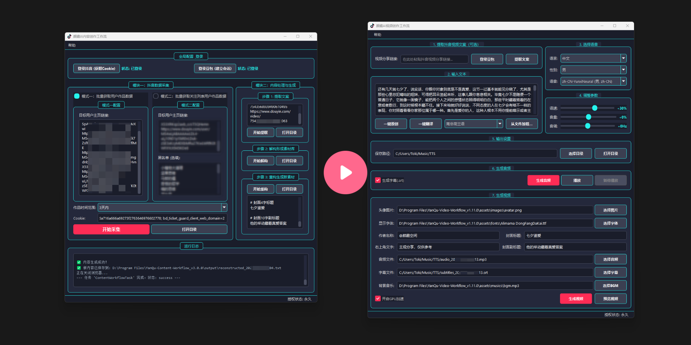
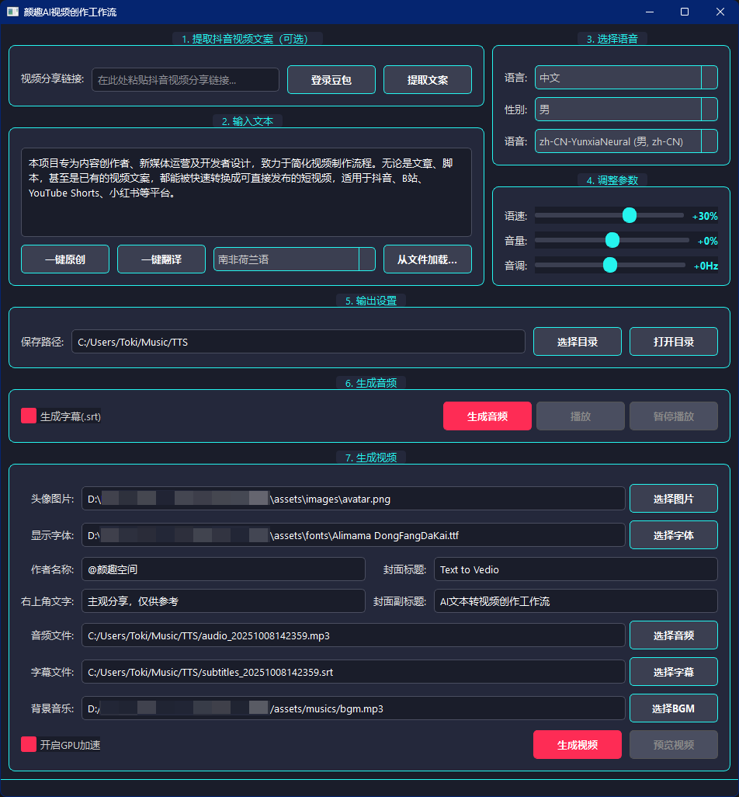

# AI TTV Workflow

[简体中文](./README.md) | [English](./README_en.md)

A text-to-video workflow prototype for content operations teams.

The project combines copy preparation, speech synthesis, subtitle generation, visual configuration, and video rendering in a desktop application. It explores how repetitive production steps can be reduced while keeping human review and approval in the process.

## Context

Producing a video from a written script often requires moving text, audio, subtitles, and assets across several tools. The fragmented workflow increases file-management overhead and creates inconsistent content versions.

AI TTV Workflow organizes these steps into a visual pipeline for input, editing, generation, and preview.

## Intended Users

- Operations teams producing knowledge or presenter-style videos
- Product and technical teams validating text-to-video workflows
- Creators who need repeatable voice, subtitle, cover, and layout settings

## Capabilities

- **Script intake and refinement**: accept manually entered text or extract a script from a shared video link; AI-assisted rewriting and translation entry points cover dozens of languages, and every rewrite returns to the user for editing and approval
- **Speech synthesis with fine control**: generate natural voices with Edge TTS across languages and speakers, with adjustable rate, pitch, and volume to match the tone of the content
- **Synchronized subtitles**: produce SRT subtitles aligned with the generated audio in the same pass — no manual re-timing
- **Brand visual configuration**: configure a circular avatar, fonts, author name, background music, and video parameters; automatically generate 9:16 vertical covers for short-video platforms
- **Rendering with hardware acceleration**: compose audio, video, subtitles, and covers with FFmpeg, with optional NVIDIA NVENC GPU acceleration to shorten render times
- **Desktop task management**: preview results and monitor task state in a PyQt5 interface; the browser-assisted features automatically download the `chromedriver` matching the installed Chrome version on first use

## 📸 Screenshots

<p align="center">
  <a href="https://www.bilibili.com/video/BV1mzhXzsEJ1" target="_blank">
    
  </a>
  <br>
  <em>Demo video cover (click the image to watch the full walkthrough).</em>
</p>
<p align="center">
  
  <br>
  <em>Main interface: every step of the workflow laid out top to bottom.</em>
</p>
<p align="center">
  
  <br>
  <em>An automatically generated 9:16 vertical cover.</em>
</p>

## Workflow

```text
Text input
    -> Review and editing
    -> Speech synthesis
    -> Subtitle generation
    -> Visual configuration
    -> FFmpeg rendering
    -> Preview and export
```

## Code Structure

- `core/app_controller.py`: application orchestration
- `core/services/`: text, speech, and video services
- `core/ui/`: desktop interface and preview components
- `core/utils/`: process, data, and driver management
- `main.py`: application entry point

Core technologies: Python, PyQt5, Edge TTS, Selenium, FFmpeg, and Pillow.

## Quick Start

### Requirements

- Python 3.8+
- FFmpeg available on `PATH` (verify with `ffmpeg -version`)
- Google Chrome when browser-assisted features are enabled

### Installation & Launch

1. Clone the repository and create a virtual environment:

```bash
git clone https://github.com/toki-plus/ai-ttv-workflow.git
cd ai-ttv-workflow
python -m venv venv
# Windows: venv\Scripts\activate
# macOS/Linux: source venv/bin/activate
```

2. Install dependencies:

```bash
pip install -r requirements.txt
```

3. Run the application:

```bash
python main.py
```

The first time a browser-assisted feature is used, the application automatically downloads the `chromedriver` matching the installed Chrome version. The top-to-bottom layout of the interface is the recommended workflow: get or enter the script → edit and refine → pick a voice and tune rate/pitch/volume → generate audio and subtitles → configure avatar, fonts, and BGM (enable GPU acceleration on NVIDIA hardware) → render the video and cover.

## Responsible Use and Limitations

- AI-generated or rewritten content should be reviewed before publication.
- Browser automation depends on third-party page structures and may require maintenance.
- Users must have appropriate rights to all text, audio, video, and other media used in the workflow.
- The current version does not include comprehensive automated tests or CI.

## What This Project Demonstrates

The project demonstrates workflow decomposition, service boundaries, and a human-in-the-loop approach to content automation: script editing, voice selection, and parameter configuration all keep a human decision point, while automation handles only the repetitive transfer and rendering work.

## 📂 More Projects

- [video-mover](https://github.com/toki-plus/video-mover) — Automated multi-platform content distribution pipeline: media processing, metadata generation, scheduling, platform adapters
- [ai-highlight-clip](https://github.com/toki-plus/ai-highlight-clip) — Long-video smart triage: Whisper transcription + LLM scoring + human review
- [ai-video-workflow](https://github.com/toki-plus/ai-video-workflow) — Multi-model AIGC video pipeline orchestrating image, video and music services
- [ai-mixed-cut](https://github.com/toki-plus/ai-mixed-cut) — Video re-creation workflow via structured asset library and script reassembly
- [ai-trader-for-mt4](https://github.com/toki-plus/ai-trader-for-mt4) — LLM×MT4 controlled-execution framework: constrained tools, risk rules, state management
- [ai-trader-for-mt5](https://github.com/toki-plus/ai-trader-for-mt5) — AI trading assistant and EA engineering framework for MetaTrader 5
- [auto-usps-tracker](https://github.com/toki-plus/auto-usps-tracker) — Batch shipment tracking and Excel reporting for cross-border e-commerce
- [AB-Video-Deduplicator](https://github.com/toki-plus/AB-Video-Deduplicator) — Experimental video re-creation tool based on high-frame-rate blending
- [netease-downloader](https://github.com/toki-plus/netease-downloader) — Netease Cloud Music desktop downloader: QR login, queue, ID3 tagging

## License

See [LICENSE](./LICENSE).
